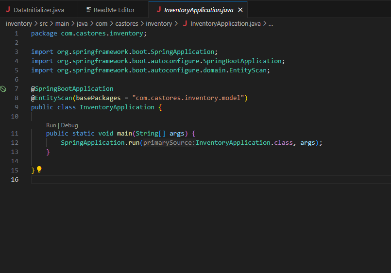

# evaluacion_tecnica
 

## Features  
- Accessibility in VS Code  
- Download directly to project root  
- Live Previews    
- IDE utilizado:
Visual Studio Code
- Versión del lenguaje de programación utilizado.
openjdk version “21.0.3” 2024-04-16 LTS
OpenJDK Runtime Environment Temurin-21.0.3+9 (build 21.0.3+9-LTS)
OpenJDK 64-Bit Server VM Temurin-21.0.3+9 (build 21.0.3+9-LTS, mixed mode, sharing)
- DBMS utilizado y su versión.
SQL Server Management Studio 20.1.10.0
- Librerias y/o complementos de software
Microsoft .NET Framework 4.0.30319.42000

-	Lista de pasos para correr su aplicación.

## Deployment  
1. Abrir y ejecutar el archvo inventoryDB.sql que se encuentra en la carperta SCRIPTS.
para preconfigurar las tablas y el usuario/password que se usará para la conexión.
2. Verificar que el archivo application.properties contenga los siguientes datos:
### application.properties 
spring.application.name=inventory
server.port=8080
spring.datasource.url=jdbc:sqlserver://localhost:1433;trustServerCertificate=true;databaseName=InventoryDB
spring.datasource.username=castores
spring.datasource.password=M95QHZnCgbUmrF3
spring.datasource.driver-class-name=com.microsoft.sqlserver.jdbc.SQLServerDriver
spring.jpa.properties.hibernate.dialect=org.hibernate.dialect.SQLServerDialect
spring.jpa.hibernate.ddl-auto=update
spring.jpa.show-sql=true
spring.jpa.properties.hibernate.format_sql=true
debug=true
logging.level.root=INFO
logging.level.com.castores.inventory=INFO
logging.pattern.console=%d{yyyy-MM-dd HH:mm:ss} %-5level %logger{36} - %msg%n

3. Considerar que la web app correrá en localhost:8080

## Run Application

Desde Visual Studio Code, abrir el archivo y dar clic en el boton Run
## Screenshots  
